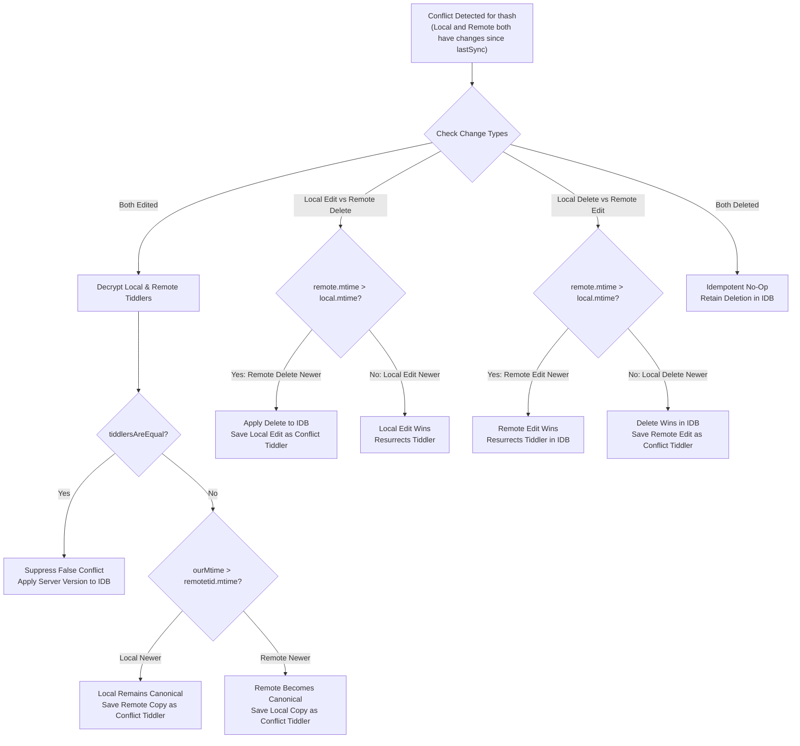

# Conflict Detection & Non-Destructive Resolution

In an offline-first system where devices operate disconnected for hours or days, concurrent updates to the same document are inevitable. TiddlyPWA implements a **content-aware, non-destructive conflict resolution engine** that preserves data integrity while preventing silent overwrites.

---

## 1. Conflict Detection Philosophy

1. **Zero Data Loss**: When two devices diverge, neither edit is discarded. One version is chosen as canonical; the other is safely preserved as a dedicated conflict tiddler.
2. **False Conflict Suppression**: If two devices make identical edits (or save without changing content), the engine detects payload equality and suppresses false conflict warnings.
3. **Transparent User Workflows**: Conflicts are announced via toast notifications, marked with a prominent banner, and managed within a dedicated Control Panel workspace.
4. **Server Agnosticism**: Because the server has zero knowledge of plaintext content, the conflict engine runs entirely on the client during synchronization.

---

## 2. The 4-Way Conflict Matrix

When a client receives a remote tiddler that conflicts with a local unsynced change (`ourtid` exists in `localChangesByHash`), it evaluates the **4-Way Conflict Matrix**:



### Detailed Scenario Specifications

| Scenario                     | Local State | Remote State | Timestamp Precedence          | Canonical Outcome             | Conflict Copy Generated              |
| :--------------------------- | :---------- | :----------- | :---------------------------- | :---------------------------- | :----------------------------------- |
| **Edit vs Edit (Identical)** | Modified    | Modified     | Any                           | Remote applied                | **None** (False conflict suppressed) |
| **Edit vs Edit (Divergent)** | Modified    | Modified     | `local.mtime > remote.mtime`  | Local remains active          | **Remote** saved as conflict tiddler |
| **Edit vs Edit (Divergent)** | Modified    | Modified     | `remote.mtime >= local.mtime` | Remote applied                | **Local** saved as conflict tiddler  |
| **Edit vs Delete**           | Modified    | Deleted      | `remote.mtime > local.mtime`  | Deleted from active wiki      | **Local** saved as conflict tiddler  |
| **Edit vs Delete**           | Modified    | Deleted      | `local.mtime >= remote.mtime` | Local edit wins (resurrects)  | **None**                             |
| **Delete vs Edit**           | Deleted     | Modified     | `remote.mtime > local.mtime`  | Remote edit wins (resurrects) | **None**                             |
| **Delete vs Edit**           | Deleted     | Modified     | `local.mtime >= remote.mtime` | Deleted from active wiki      | **Remote** saved as conflict tiddler |
| **Delete vs Delete**         | Deleted     | Deleted      | Any                           | Deleted                       | **None** (Idempotent tombstone)      |

---

## 3. False Conflict Suppression (`tiddlersAreEqual`)

To avoid spamming users with unnecessary conflict prompts when saving identical changes from multiple tabs or devices:

```javascript
tiddlersAreEqual(a, b) {
    if (!a || !b) return false;
    if ((a.text || '') !== (b.text || '')) return false;

    // Volatile timestamps and revision tracking fields are excluded
    const ignored = new Set(['modified', 'created', 'revision']);
    const keysA = Object.keys(a).filter((k) => !ignored.has(k));
    const keysB = Object.keys(b).filter((k) => !ignored.has(k));

    if (keysA.length !== keysB.length) return false;
    return keysA.every((k) => a[k] === b[k]);
}
```

If the payload fields and body text match exactly, the sync engine treats the collision as redundant and transparently accepts the server state.

---

## 4. Conflict Tiddler Data Model

When a superseded version is preserved, it is created as a first-class tiddler with standardized metadata:

### Naming Convention

```javascript
<Original Title> (Conflict YYYY-MM-DD HH:MM:SS)
```

If multiple conflicts arise for the same title within the same second, an incrementing counter is appended:

```javascript
<Original Title> (Conflict YYYY-MM-DD HH:MM:SS 2)
```

### Metadata Fields

- **`tags`**: Inherits all original tags plus `$:/tags/TiddlyPWA/Conflict`.
- **`tiddlypwa-conflict-of`**: Plaintext title of the canonical tiddler this conflict relates to.
- **`tiddlypwa-conflict-source`**: Origin of the preserved version (`local` or `remote`).
- **`tiddlypwa-conflict-date`**: ISO 8601 timestamp of when the conflicted edit was authored.

---

## 5. User Interface & Resolution Workflow

### 1. Alert Notification

Upon completing a sync that produced conflict copies, the client displays an alert toast:

- Tiddler: `$:/plugins/valpackett/tiddlypwa/notif-conflict`
- Status Counter: Updates `$:/status/TiddlyPWAConflictsCount`

### 2. Persistent Warning Banner

A top-of-page warning banner is injected via `$:/tags/PageTemplate`:

- Rendered by: [`plugins/tiddlypwa/banner-conflict.tid`](file:///Users/mblackman/workspace/gh/tiddlypwa/plugins/tiddlypwa/banner-conflict.tid)
- Provides a direct action button: `Review Conflicts` (navigates to Control Panel).

### 3. Conflict Resolution Control Panel

Located under **ControlPanel -> Storage and Sync -> Conflicts** ([`config-conflicts.tid`](file:///Users/mblackman/workspace/gh/tiddlypwa/plugins/tiddlypwa/config-conflicts.tid)):

For each conflicted tiddler, the user can inspect both copies side by side and choose one of two actions:

1. **"Keep This Version"**:
   - Overwrites the original canonical tiddler with the text and tags from the conflict copy.
   - Cleanses conflict fields (`tiddlypwa-conflict-of`, `tiddlypwa-conflict-source`, `tiddlypwa-conflict-date`).
   - Removes `$:/tags/TiddlyPWA/Conflict`.
   - Automatically deletes the conflict tiddler.
2. **"Discard Conflict Copy"**:
   - Deletes the conflict tiddler, accepting the current canonical version.

---

## 6. IndexedDB Transaction Decoupling (Critical Fix)

### The Asynchronous Transaction Problem

In Web browsers, an IndexedDB transaction auto-commits as soon as the microtask loop becomes empty with no active IDB requests pending.
Because WebCrypto operations (`crypto.subtle.decrypt`, `crypto.subtle.encrypt`) return native JavaScript Promises that resolve across event loop turns, **awaiting a cryptographic call inside an open IDB transaction callback causes the browser to prematurely commit or abort the transaction with `TransactionInactiveError`**.

### The Solution Architecture

TiddlyPWA enforces strict decoupling:

1. **Phase 1: In-Memory Decryption & Resolution**
   - Read dirty local records and incoming server records into memory.
   - Perform all `crypto.subtle.decrypt` calls asynchronously outside of any IDB transaction.
   - Run `tiddlersAreEqual` and construct `idbWrites` and `conflictTiddlersToAdd` arrays in memory.
2. **Phase 2: Synchronous Batch Commit**
   - Open a single `readwrite` transaction on the `tiddlers` store:
     ```javascript
     const txn = this.db.transaction('tiddlers', 'readwrite');
     const store = txn.objectStore('tiddlers');
     for (const tid of idbWrites) {
     	store.put(tid);
     }
     await new Promise((resolve, reject) => {
     	txn.oncomplete = resolve;
     	txn.onerror = () => reject(txn.error);
     });
     ```
   - Commit all canonical writes in a single microtask turn.
3. **Phase 3: Runtime Notification**
   - Add conflict copies into the TiddlyWiki runtime store (`this.wiki.addTiddler(...)`), which automatically initiates background encryption and server replication for the newly generated conflict copies.
