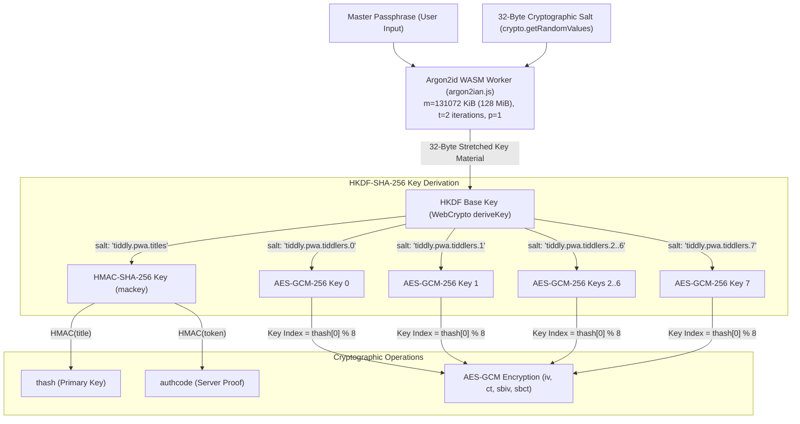

# Cryptography & Zero-Knowledge Security Model

TiddlyPWA enforces an **end-to-end, zero-knowledge encryption architecture**. The sync server functions strictly as an encrypted blob store and is cryptographically blind to wiki content, tiddler titles, tags, and custom fields.

---

## 1. Threat Model & Security Boundaries

### Assumed Adversaries

| Threat Actor                                                                        | Capabilities                                                                   | TiddlyPWA Defenses                                                                                                                                                                             |
| :---------------------------------------------------------------------------------- | :----------------------------------------------------------------------------- | :--------------------------------------------------------------------------------------------------------------------------------------------------------------------------------------------- |
| **Passive Server Snooper** (Hosting provider, network sniffer, cloud operator)      | Full read access to server SQLite database, filesystem, and transport streams. | **Complete Protection**: Content is AES-GCM-256 encrypted before transmission. Titles are keyed HMAC digests. Payloads are padded to prevent length leakage.                                   |
| **Active Server Attacker**                                                          | Can modify SQLite rows, tamper with network packets, or forge timestamps.      | **Tamper Detection**: AES-GCM authenticated tags reject modified ciphertexts. Timestamps are cross-checked (`ETIMESYNC` < 60s). Authcodes prevent cross-wiki tampering.                        |
| **Local Device Unauthorized User** (Friend inspecting device, lost unlocked laptop) | Physical access to browser window when closed.                                 | **Protected by Default**: Unless "Remember Password" is explicitly enabled, encryption keys reside purely in volatile JS memory and are destroyed when the tab closes.                         |
| **Malicious App Host (Active Server Update)**                                       | Attacker replaces `app.html` on the server with malicious JavaScript.          | **Architectural Isolation**: Users can host `app.html` independently (e.g., local file, GitHub Pages, Syncthing) while pointing sync to a separate server, achieving full Separation of Trust. |

---

## 2. Key Derivation Hierarchy



### 2.1 Password Hashing with Argon2id

- **Implementation**: [`plugins/tiddlypwa/argon2ian.js`](file:///Users/mblackman/workspace/gh/tiddlypwa/plugins/tiddlypwa/argon2ian.js) embeds an optimized, WebAssembly-compiled Argon2 library executed inside a dedicated Web Worker.
- **Parameters**:
  - Memory Cost ($m$): $131,072\text{ KiB}$ ($128\text{ MiB}$)
  - Time Cost ($t$): $2\text{ iterations}$
  - Parallelism ($p$): $1$
  - Variant: `Argon2id` (hybrid data-dependent / data-independent mode offering resistance against both side-channel and GPU-based dictionary attacks).
- **Rationale for Web Worker**: Argon2 key stretching requires intensive CPU and memory allocation. Executing it in a worker prevents freezing the browser main thread and allows progress reporting in `BootstrapModal`.

### 2.2 HKDF-SHA-256 Key Expansion

WebCrypto derives the primary HKDF key using the raw 32 bytes from Argon2id:

```javascript
const basekey = await crypto.subtle.importKey('raw', basebits, 'HKDF', false, ['deriveKey']);
```

From this master key, 9 distinct keys are derived:

1. **8 Content Encryption Keys (`AES-GCM-256`)**:
   - HKDF Salt: `utfenc.encode('tiddly.pwa.tiddlers.' + i)` for $i \in [0..7]$
   - Usages: `['encrypt', 'decrypt']`
2. **1 Message Authentication Key (`HMAC-SHA-256`)**:
   - HKDF Salt: `utfenc.encode('tiddly.pwa.titles')`
   - Usages: `['sign']`

---

## 3. Cryptographic Wear-out Mitigation (The 8-Key Design)

In symmetric authenticated encryption using `AES-GCM`, nonces must never repeat under the same key. Furthermore, the birthday paradox imposes a theoretical boundary on how many random 96-bit (12-byte) nonces can be safely generated before collision probability becomes unacceptable.

- Under a single AES-GCM key with random nonces, safe operational limits generally cap usage around $2^{32}$ (approx. 4.2 billion) encryptions.
- While 4 billion encryptions is large for a personal notebook, TiddlyPWA distributes encryptions across **8 independent AES-GCM keys**:
  $$\text{Key Index} = \text{DataView}(thash).\text{getUint8}(0) \pmod 8$$
- This increases the total system encryption capacity to over **34 billion write operations** without key regeneration, ensuring mathematically negligible nonce collision risk.

---

## 4. Keyed Title Hashing (`thash`)

Tiddler titles are never stored as plaintext in either IndexedDB or SQLite.

- **Formula**:
  $$\text{thash} = \text{HMAC-SHA-256}(\text{encodeUtf8}(\text{title}), \text{mackey})$$
- **Privacy Properties**:
  - **Irreversibility**: A server operator cannot deduce tiddler titles from the database.
  - **Correlation Prevention**: Because `mackey` is derived from each user's unique password and salt, identical tiddler titles (e.g. `Index`, `Journal`, `Tasks`) produce completely different `thash` values across different wikis.
- **Lookup Stability**: For a given wiki, `thash` is deterministic, allowing SQLite and IndexedDB to index rows using `thash` as the primary key.

---

## 5. Zero-Knowledge Server Authentication (`authcode`)

To prevent accidental mixing of data if two different wikis attempt to sync to the same backend storage token:

- **Formula**:
  $$\text{authcode} = \text{Base64Url}(\text{HMAC-SHA-256}(\text{token}, \text{mackey}))$$
- **Protocol Flow**:
  1. On first sync, the server registers the client's `authcode` alongside its `salt`.
  2. On subsequent syncs, the server verifies that incoming requests present the exact same `authcode`.
  3. The server never learns the user's password or decryption keys; the `authcode` is a zero-knowledge possession proof.

---

## 6. Data Packing, Compression & Padding (`encoding.js`)

Before AES-GCM encryption, plaintext payloads undergo serialization, optional compression, and block padding in [`plugins/tiddlypwa/encoding.js`](file:///Users/mblackman/workspace/gh/tiddlypwa/plugins/tiddlypwa/encoding.js):

### Binary Framing Structure

```
+---------------+------------------------+------------------------------------+--------------------------+
| Flags (1 Byte)| Body Length (4 Bytes)  | Body Payload (N Bytes)            | Padding (0..255 Bytes)   |
| [uint8]       | [uint32 big-endian]    | [UTF-8 / Gzip / Binary]            | [Zero-filled bytes]      |
+---------------+------------------------+------------------------------------+--------------------------+
```

- **Bit 0 (`flags & 1`)**: Binary data flag (indicates unBase64 raw binary bytes).
- **Bit 1 (`flags & 2`)**: Gzip compression flag (indicates compression via `CompressionStream('gzip')`).
- **Gzip Compression Rationale**: Applied automatically if the plaintext exceeds 512 bytes and is not already binary.
- **Padding Rationale**: Encrypted lengths can leak information about note sizes (traffic analysis). Payloads are padded up to a multiple of **256 bytes**, obscuring the exact file size.

---

## 7. Separate Body Encryption for Lazy Loading

TiddlyWiki supports **Skinny Tiddlers** (loading titles, tags, and metadata into the DOM while deferring full text loading until opened).

TiddlyPWA supports this natively while maintaining full encryption:

1. **Metadata Ciphertext (`iv`, `ct`)**:
   - Contains a JSON payload of all tiddler fields _except_ `text` (e.g. `title`, `tags`, `modified`, `type`).
   - Encrypted with AES-GCM and padded to 256 bytes.
2. **Body Ciphertext (`sbiv`, `sbct`)**:
   - Generated only when the tiddler has text longer than 256 characters or is binary.
   - Encrypted separately with a fresh random 96-bit IV.
3. **Eager Loading Exceptions (`mustEagerLoad`)**:
   - System tiddlers (`$:/...`) and tiddlers tagged with system tags are always eagerly decrypted during startup to ensure UI widgets and macros function without delay.

---

## 8. Cryptographic Specifications Summary

| Primitive                    | Parameter / Standard                               | Usage                                               |
| :--------------------------- | :------------------------------------------------- | :-------------------------------------------------- |
| **KDF (Passphrase -> Base)** | Argon2id ($m=128\text{ MiB}, t=2, p=1$)            | Stretches user password with 32-byte salt           |
| **KDF (Base -> Keys)**       | HKDF-SHA-256                                       | Expands base key into 8 AES keys + 1 HMAC key       |
| **Symmetric Cipher**         | AES-GCM-256 (128-bit auth tag)                     | Authenticated encryption of metadata and body       |
| **Symmetric Nonce**          | 96-bit (12-byte) CSPRNG (`crypto.getRandomValues`) | Fresh per ciphertext encryption                     |
| **Keyed MAC**                | HMAC-SHA-256                                       | Deterministic `thash` and zero-knowledge `authcode` |
| **Compression**              | Gzip via Web Streams `CompressionStream`           | Pre-encryption compression for texts > 512 bytes    |
| **Traffic Padding**          | 256-byte block alignment                           | Elimination of granular ciphertext length leakage   |
