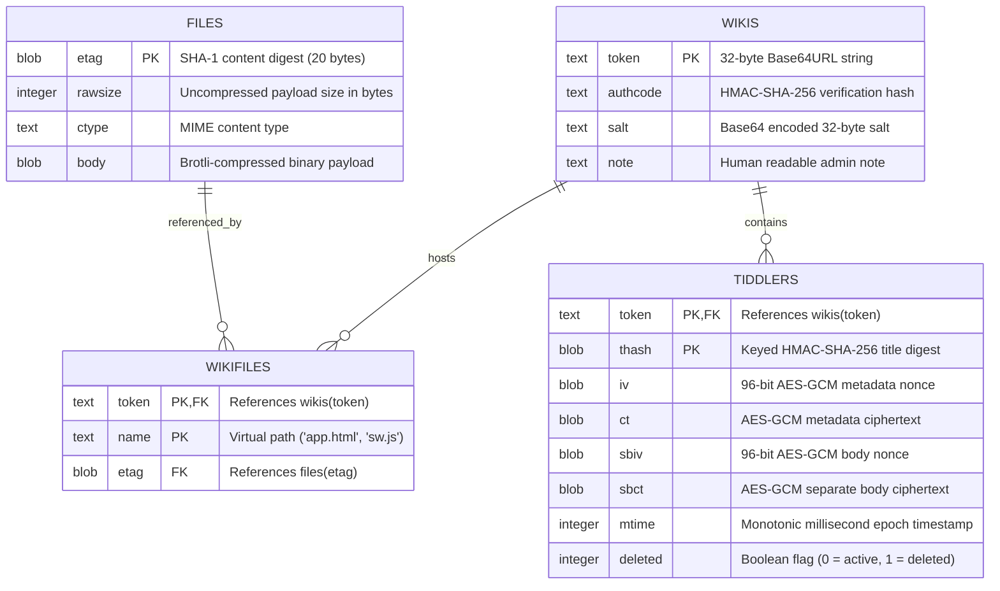

# Data Models, Schemas & Storage Design

TiddlyPWA relies on a dual-layer data architecture:

1. **Server Storage**: Embedded SQLite database operating in `STRICT` mode with multi-tenant isolation.
2. **Client Storage**: Browser IndexedDB database scoped uniquely to the instance URL path.

---

## 1. Entity-Relationship Diagram (Server Database)



---

## 2. Server-Side SQLite Schema (`server/sqlite.ts`)

The SQLite database uses `STRICT` tables to enforce type safety.

### 2.1 Complete DDL Specification

```sql
PRAGMA foreign_keys = ON;

-- 1. Tenants / Wikis Table
CREATE TABLE wikis (
    token TEXT PRIMARY KEY NOT NULL,
    authcode TEXT,
    salt TEXT,
    note TEXT
) STRICT;

-- 2. Deduplicated File Asset Blob Store
CREATE TABLE files (
    etag BLOB PRIMARY KEY NOT NULL,
    rawsize INTEGER NOT NULL,
    ctype TEXT NOT NULL,
    body BLOB NOT NULL
) STRICT;

-- 3. Tenant File Ingestion Mapping
CREATE TABLE wikifiles (
    token TEXT NOT NULL,
    etag BLOB NOT NULL,
    name TEXT NOT NULL,
    FOREIGN KEY(token) REFERENCES wikis(token) ON DELETE CASCADE,
    FOREIGN KEY(etag) REFERENCES files(etag),
    PRIMARY KEY (token, name)
) STRICT;

-- 4. Orphaned File Blob Cleaner Trigger
CREATE TRIGGER files_cleanup AFTER DELETE ON wikifiles BEGIN
    DELETE FROM files
    WHERE etag = OLD.etag
      AND (SELECT COUNT(*) FROM wikifiles WHERE etag = OLD.etag) = 0;
END;

-- 5. Encrypted Tiddler Revisions Table
CREATE TABLE tiddlers (
    token TEXT NOT NULL,
    thash BLOB NOT NULL,
    iv BLOB,
    ct BLOB,
    sbiv BLOB,
    sbct BLOB,
    mtime INTEGER NOT NULL,
    deleted INTEGER NOT NULL DEFAULT 0,
    FOREIGN KEY(token) REFERENCES wikis(token) ON DELETE CASCADE,
    PRIMARY KEY (token, thash)
) STRICT;

-- 6. Monotonic Sync Index
CREATE INDEX idx_tiddlers_token_mtime ON tiddlers (token, mtime);
```

### 2.2 Version Migration Rationale (v1 to v2)

In early versions (schema `user_version = 1`), the `tiddlers` table was indexed solely by `thash PRIMARY KEY`.

- **The Defect**: If two independent wikis hosted on the same server contained a tiddler with identical title hashes (or during testing with shared tokens), one tenant's sync write would overwrite the other's row.
- **The v2 Migration**:
  1. Purged dangling tiddlers without matching parent wikis.
  2. Transitioned `tiddlers` to a **composite primary key `(token, thash)`**.
  3. Added the covering index `idx_tiddlers_token_mtime (token, mtime)` to guarantee $O(\log N)$ delta sync queries.
  4. Enabled `PRAGMA foreign_keys = ON` with cascading deletes, ensuring that deleting a wiki automatically cleans all encrypted tiddlers and file mappings.

---

## 3. Client-Side IndexedDB Schema

Browser persistence is maintained in an IndexedDB database named:

```text
tiddlypwa:${location.pathname}
```

Scoping to `location.pathname` ensures multiple wikis hosted on the same origin (e.g. `https://example.com/wiki1/app.html` and `https://example.com/wiki2/app.html`) never collide in storage.

### 3.1 Object Stores Reference

| Object Store      | Key Path      | Auto Increment | Record Structure                                                            | Purpose                                                         |
| :---------------- | :------------ | :------------- | :-------------------------------------------------------------------------- | :-------------------------------------------------------------- |
| **`metadata`**    | _Out-of-line_ | Yes            | `{ salt: Uint8Array }`                                                      | Stores the wiki's 32-byte master salt                           |
| **`session`**     | _Out-of-line_ | Yes            | `{ enckeys: CryptoKey[], mackey: CryptoKey }`                               | Stores derived WebCrypto keys if "Remember Password" is toggled |
| **`syncservers`** | _Out-of-line_ | Yes            | `{ url: string, token: string, lastSync: Date }`                            | Configuration and high-water timestamps for remote sync servers |
| **`tiddlers`**    | `thash`       | No             | `{ thash: ArrayBuffer, iv, ct, sbiv, sbct, mtime: Date, deleted: boolean }` | Canonical local encrypted tiddler repository                    |

---

## 4. TiddlyWiki Runtime Status & Configuration Register

TiddlyPWA exposes its internal state to the TiddlyWiki reactive macro/widget engine through standard system tiddlers:

### 4.1 Status Tiddlers (`$:/status/TiddlyPWA*`)

| Tiddler Title                         | Values                 | Description                                                                     |
| :------------------------------------ | :--------------------- | :------------------------------------------------------------------------------ |
| `$:/status/TiddlyPWAOnline`           | `yes`, `no`            | Network connectivity indicator wired to browser `online`/`offline` events       |
| `$:/status/TiddlyPWASyncing`          | `yes`, `no`            | Active sync lock indicator (applies `.tiddlypwa-syncing` CSS class to `<body>`) |
| `$:/status/TiddlyPWASyncingWith`      | URL string             | The server URL currently executing a sync operation                             |
| `$:/status/TiddlyPWARealtime`         | Status string          | SSE connection state (`connecting to...`, `connected to...`, `no sync servers`) |
| `$:/status/TiddlyPWARemembered`       | `yes`, `no`            | Whether derived encryption keys are saved in IndexedDB `session` store          |
| `$:/status/TiddlyPWAConflictsCount`   | Integer string         | Count of tiddlers currently tagged with `$:/tags/TiddlyPWA/Conflict`            |
| `$:/status/TiddlyPWAStoragePersisted` | `yes`, `no`, `unavail` | Result of `navigator.storage.persisted()`                                       |
| `$:/status/TiddlyPWAStorageQuota`     | Formatted string       | Human-readable quota breakdown: `<used> of <total> (<percent>%)`                |
| `$:/status/TiddlyPWASalt`             | Base64 string          | Encoded salt value displayed in settings for manual wiki initialization         |
| `$:/status/TiddlyPWAUpdateAvailable`  | `yes`                  | Set by Service Worker when background revalidation discovers a newer app build  |
| `$:/status/TiddlyPWADocsMode`         | `yes`                  | Flags that the instance is running in read-only documentation/installer mode    |

### 4.2 Temporary & Control Tiddlers (`$:/temp/TiddlyPWA*`)

| Tiddler Title                    | Purpose                                                              |
| :------------------------------- | :------------------------------------------------------------------- |
| `$:/temp/TiddlyPWAServers/<key>` | Dynamically generated representation of each configured sync server  |
| `$:/temp/HideConflictBanner`     | Set to `yes` when the user dismisses the top conflict warning banner |

### 4.3 Control Panel Tabs (`$:/tags/ControlPanel/TiddlyPWA`)

The TiddlyPWA settings panel (`$:/plugins/valpackett/tiddlypwa/config`) renders child tabs:

- **`config-storage.tid`**: Storage persistence, quota inspection, and database deletion.
- **`config-sync.tid`**: Remote server URL and token management with connection testing.
- **`config-crypto.tid`**: Password remembering toggle and salt export.
- **`config-conflicts.tid`**: Dedicated side-by-side conflict review and resolution workspace.
- **`config-support.tid`**: Sponsor and upstream contribution information.
