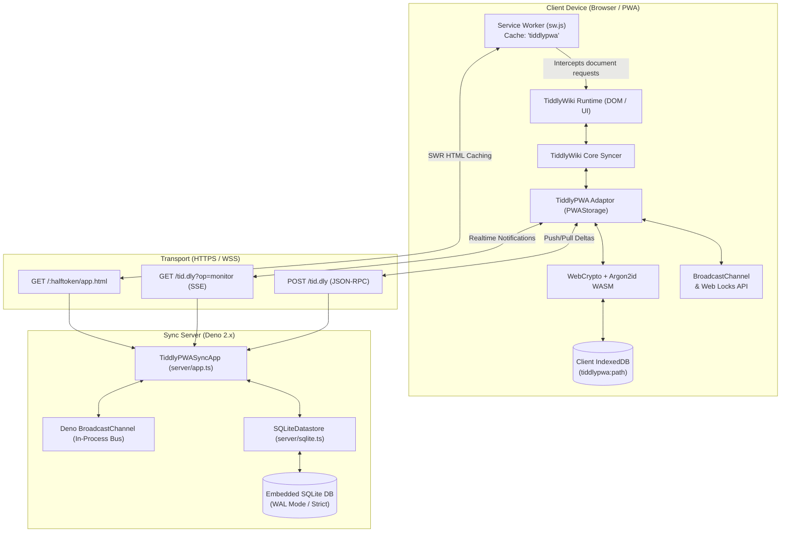
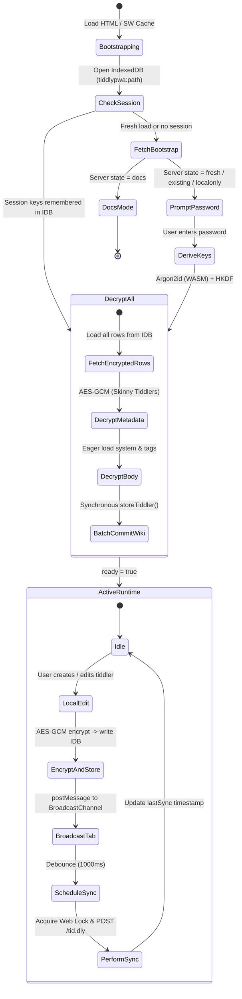

# System Overview & Architecture

**TiddlyPWA** is an offline-first, client-side encrypted personal wiki solution. It embeds [TiddlyWiki 5](https://tiddlywiki.com) within a modern Progressive Web App (PWA) architecture backed by zero-knowledge synchronization to a lightweight server.

---

## 1. Architectural Philosophy

1. **Local-First / Offline-First**: All read and write operations execute against browser storage ([IndexedDB](https://developer.mozilla.org/en-US/docs/Web/API/IndexedDB_API)). Network availability is treated as an opportunistic enhancement rather than a hard dependency.
2. **Zero-Knowledge Security**: The server is treated as an untrusted carrier. It stores only ciphertexts, Initialization Vectors (IVs), cryptographic salts, keyed HMAC digests, and monotonic timestamps. It has no mechanism to decrypt wiki contents.
3. **Dual Storage Model**:
   - **Wiki Content (Tiddlers)**: Stored individually in encrypted form in client IndexedDB and synchronized with server SQLite.
   - **Wiki Engine & Core Extensions (App HTML)**: Standalone compiled HTML file containing the TiddlyWiki boot kernel, themes, and plugins. It is cached by a Service Worker and can be updated in-place via an authenticated server upload.
4. **Multi-Tenancy & Lightweight Footprint**: A single backend server instance written in Deno and backed by an embedded SQLite database can securely host hundreds of independent wikis with strict data isolation.

---

## 2. High-Level System Topology



---

## 3. Core Component Breakdown

### 3.1 Client Components

#### `PWAStorage` (`plugins/tiddlypwa/main.js`)

The central coordinator implementing TiddlyWiki's `syncadaptor` interface. It:

- Intercepts tiddler CRUD operations (`saveTiddler`, `loadTiddler`, `deleteTiddler`).
- Orchestrates cryptographic derivation via WebCrypto and the Argon2 WebAssembly worker.
- Manages local persistence across IndexedDB object stores (`tiddlers`, `metadata`, `session`, `syncservers`).
- Implements background synchronization loops, multi-tab coordination, and conflict resolution workflows.

#### `BootstrapModal` (`plugins/tiddlypwa/bootstrap.js`)

Responsible for first-boot orchestration:

- Fetches `bootstrap.json` to identify whether the instance is in documentation mode (`docs`), fresh synchronized mode (`fresh`), existing synchronized mode (`existing`), or standalone local mode (`localonly`).
- Renders an interactive login modal for password entry, token configuration, and salt ingestion.
- Displays responsive progress feedback during initial Argon2id key derivation and tiddler decryption.

#### `PWASaver` & `DummySaver` (`plugins/tiddlypwa/saver.js`, `plugins/tiddlypwa/kill-put-saver.js`)

- `PWASaver` intercepts manual save clicks and routes them to either local storage commit or full application HTML upload.
- `DummySaver` neutralizes TiddlyWiki's legacy `$:/core/modules/savers/put.js` module, which unhelpfully emits premature `OPTIONS` and `HEAD` network requests during startup.

#### `sw.js` (Service Worker)

- Employs a **Stale-While-Revalidate (SWR)** caching strategy for document requests.
- Caches the compiled `app.html` bundle into CacheStorage (`tiddlypwa`).
- Revalidates in the background against the server; if the server serves a newer ETag, broadcasts an `{ op: 'refresh' }` message to client tabs to prompt for an instant update.

#### Web App Manifest Generator (`plugins/web-app-manifest/main.js`)

- Dynamically renders a W3C Web App Manifest from wiki tiddlers (`name`, `theme-color`, `background-color`, and `$:/tags/ManifestIcon`).
- Injects a Blob URL manifest link tag into the document `<head>`, enabling PWA home-screen installation on desktop and mobile.

---

### 3.2 Server Components

#### `TiddlyPWASyncApp` (`server/app.ts`)

The unified HTTP request handler:

- Implements route decorators (`@route`, `@adminAuth`, `@getWiki`) over web-standard `Request` and `Response`.
- Handles JSON-RPC operations at `/tid.dly` (`sync`, `uploadapp`, `list`, `create`, `delete`, `reauth`).
- Streams real-time Server-Sent Events (SSE) at `/tid.dly?op=monitor`.
- Serves static wiki bundles at `/:halftoken/:filename` with Brotli decompression or pass-through based on `Accept-Encoding` headers.
- Employs streaming JSON chunking (`streamsponse`) for syncing large tiddler deltas without excessive memory buffering.

#### `SQLiteDatastore` (`server/sqlite.ts`)

- Wraps embedded SQLite using `sqlite` library with strict PRAGMAs (`foreign_keys = ON; user_version = 2`).
- Provides atomic transactions for multi-row sync operations.
- Enforces multi-tenant data isolation by composite primary keys `(token, thash)` on `tiddlers` and `(token, name)` on `wikifiles`.
- Executes monotonic Last-Write-Wins (LWW) upserts:
  ```sql
  INSERT INTO tiddlers (token, thash, iv, ct, sbiv, sbct, mtime, deleted)
  VALUES (:token, :thash, :iv, :ct, :sbiv, :sbct, :mtime, :deleted)
  ON CONFLICT (token, thash) DO UPDATE SET
      iv = excluded.iv,
      ct = excluded.ct,
      sbiv = excluded.sbiv,
      sbct = excluded.sbct,
      mtime = excluded.mtime,
      deleted = excluded.deleted
  WHERE excluded.mtime > mtime;
  ```

#### CLI Runners & Utilities (`server/run.ts`, `server/hash-admin-password.ts`)

- `run.ts`: Bootstraps the application over TCP (`--port`, `--host`) or Unix domain sockets (`--socket`), parsing command-line flags and environment variables via `@std/dotenv` and `@std/cli`.
- `hash-admin-password.ts`: Interactive CLI utility prompting for an administrative secret and generating Argon2 salt and hash strings for production environment configuration.

---

## 4. Client Runtime Lifecycle

The following state diagram illustrates the client lifecycle from initial HTTP boot to active synchronization:



---

## 5. Offline & Network Resilience Guarantees

1. **Read Offline Availability**:
   - The Service Worker serves the entire application envelope (`app.html`) instantly from `CacheStorage`.
   - IndexedDB loads the encrypted wiki payload locally, allowing complete offline decryption and viewing.
2. **Write Offline Durability**:
   - Tiddler changes are encrypted and written to IndexedDB immediately upon saving in the UI.
   - If the network is unreachable, `backgroundSync()` fails gracefully, leaving local timestamps intact.
   - Once the browser fires an `online` event or visibility returns (`visibilitychange`), `backgroundSync()` triggers automatically and synchronizes accumulated deltas.
3. **Multi-Tab Safety**:
   - `BroadcastChannel("tiddlypwa-changes:<path>")` keeps multiple open browser tabs synchronized locally in real time.
   - `navigator.locks.request("tiddlypwa:<path>")` serializes remote sync network executions so concurrent tabs never cause race conditions against the server.
