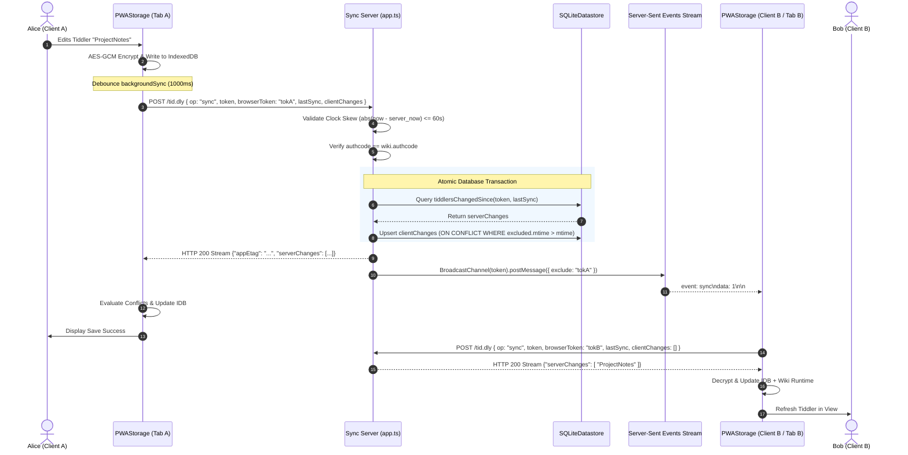

# Synchronization Protocol & Real-Time Engine

TiddlyPWA uses an incremental, delta-based synchronization protocol over HTTP with real-time push notifications delivered via Server-Sent Events (SSE).

---

## 1. Network Endpoint Overview

All API interactions flow through a single multiplexed endpoint `/tid.dly` using JSON-RPC semantics:

| Route                   | Method        | Purpose                                                                                 | Authentication                   |
| :---------------------- | :------------ | :-------------------------------------------------------------------------------------- | :------------------------------- |
| `/tid.dly`              | `POST`        | Primary JSON-RPC dispatcher (`sync`, `uploadapp`, `create`, `list`, `delete`, `reauth`) | Wiki token or Admin Argon2 token |
| `/tid.dly?op=monitor`   | `GET`         | Real-time Server-Sent Events (SSE) notification stream                                  | Wiki token                       |
| `/:halftoken/:filename` | `GET`, `HEAD` | Serves compiled wiki HTML bundles (`app.html`), service workers, and `bootstrap.json`   | Public / Token-scoped            |
| `/`                     | `GET`, `HEAD` | Self-hosted Web Admin Control Panel                                                     | Admin password                   |

---

## 2. Complete Sync Transaction Sequence

The following sequence illustrates a client updating tiddlers, transmitting deltas, receiving remote updates, and triggering real-time notification across peer devices:



---

## 3. JSON-RPC Protocol Reference (`POST /tid.dly`)

Every POST request must include headers:

```http
Content-Type: application/json
```

and must supply the root discriminator: `tiddlypwa: 1`.

### 3.1 `op: "sync"` (Delta Synchronization)

#### Request Payload Schema

```typescript
interface SyncRequest {
	tiddlypwa: 1;
	op: 'sync';
	token: string; // 32-byte URL-safe Base64 wiki token
	browserToken: string; // Ephemeral 12-byte CSPRNG string for echo suppression
	authcode: string; // HMAC-SHA-256(token, mackey) encoded in Base64
	salt?: string; // Client salt (stored on first sync)
	now: string; // ISO 8601 client timestamp (clock check)
	lastSync: string; // ISO 8601 timestamp of last successful sync
	clientChanges: Array<{
		thash: string; // Base64 keyed HMAC title hash
		iv?: string | null; // Base64 96-bit AES-GCM nonce for metadata
		ct?: string | null; // Base64 AES-GCM ciphertext of metadata
		sbiv?: string | null; // Base64 96-bit AES-GCM nonce for separate body
		sbct?: string | null; // Base64 AES-GCM ciphertext of separate body
		mtime: string; // ISO 8601 modification timestamp
		deleted?: boolean; // True if tiddler was deleted
	}>;
}
```

#### Protocol Validations

1. **Clock Skew Check**:
   $$\left|\text{Date}(\text{now}) - \text{Date}(\text{server\_time})\right| \le 60,000\text{ ms}$$
   If exceeded, the server returns `{ error: "ETIMESYNC" }` with HTTP status `400`.
2. **Authcode Integrity Check**:
   If the wiki record already has an `authcode` registered, the incoming `authcode` must match exactly. Mismatch returns `{ error: "EAUTH" }` with HTTP status `401`.
3. **Session Filtering**:
   Tiddlers matching `$:/StoryList` are strictly omitted from `clientChanges` by the client, preventing multi-tab open story fighting.

#### Response Stream Format

The response is delivered as a chunked JSON stream (`streamsponse`) to avoid buffering massive wiki deltas in server RAM:

```json
{
	"appEtag": "\"W5v...-b\"",
	"serverChanges": [
		{
			"thash": "dGVzdA==",
			"iv": "...",
			"ct": "...",
			"sbiv": null,
			"sbct": null,
			"mtime": "2026-09-21T18:00:00.000Z",
			"deleted": false
		}
	]
}
```

---

### 3.2 `op: "uploadapp"` (App HTML & Service Worker In-Place Update)

Allows a running wiki to upload an updated version of its HTML shell (e.g. after installing a new plugin or theme):

```typescript
interface UploadAppRequest {
	tiddlypwa: 1;
	op: 'uploadapp';
	token: string;
	authcode: string;
	browserToken: string;
	files: {
		'app.html': {
			body: string; // Plaintext HTML
			ctype: 'text/html;charset=utf-8';
		};
		'sw.js': {
			body: string; // Service worker JavaScript
			ctype: 'application/javascript';
		};
	};
}
```

- **Compression & Deduplication**:
  - The server computes the SHA-1 digest of each file body as its ETag.
  - If the content is new, it is compressed via Brotli (`brotli.compress(utf, 4096, 8)`) and stored in the global deduplicated `files` table.
  - The file is associated with the wiki in `wikifiles`.
- **Response**:
  ```json
  { "urlprefix": "a1b2c3d4e5f6g7h8i9j0k/" }
  ```
  Returns the 21-character prefix (half the token length) where the application is accessible.

---

### 3.3 Administrative Endpoints (`list`, `create`, `delete`, `reauth`)

Administrative operations require the `atoken` field, which is validated against the Argon2 hash of `ADMIN_PASSWORD_HASH` and `ADMIN_PASSWORD_SALT`:

```typescript
// Create a new wiki
POST /tid.dly
{ "tiddlypwa": 1, "op": "create", "atoken": "...", "note": "Personal Journal" }
// Response: HTTP 201 { "token": "<32-byte-urlsafe-base64>" }

// List all hosted wikis
POST /tid.dly
{ "tiddlypwa": 1, "op": "list", "atoken": "..." }
// Response: HTTP 200 { "wikis": [ { "token": "...", "note": "...", "salt": "...", "tidsize": 1048576, "appsize": 2097152 } ] }

// Delete a wiki and cascade-delete all encrypted rows
POST /tid.dly
{ "tiddlypwa": 1, "op": "delete", "atoken": "...", "token": "..." }

// Clear authcode to allow re-pairing with a new password/salt
POST /tid.dly
{ "tiddlypwa": 1, "op": "reauth", "atoken": "...", "token": "..." }
```

---

## 4. Real-Time Push Mechanism (Server-Sent Events)

### Connection Handshake

Clients initiate a persistent SSE stream:

```http
GET /tid.dly?op=monitor&token=<token>&browserToken=<browserToken> HTTP/1.1
Accept: text/event-stream
```

1. Server checks that `token` exists in the database (`EAUTH` on failure).
2. Server establishes an in-memory subscription to Deno's native `BroadcastChannel(token)`.
3. When any client pushes changes for that token:
   ```typescript
   const chan = new BroadcastChannel(token);
   chan.postMessage({ exclude: browserToken });
   ```
4. If `exclude !== incomingBrowserToken`, the server emits:
   ```text
   event: sync
   data: 1
   ```
5. The receiving client triggers an immediate `backgroundSync()` pull.

---

## 5. Multi-Tab Browser Coordination

Running multiple tabs of the same wiki concurrently presents two primary hazards:

1. **Network Thundering Herd**: Multiple tabs simultaneously hitting `/tid.dly` to sync identical changes.
2. **Duplicate Real-Time Streams**: Multiple tabs maintaining redundant SSE connections.

TiddlyPWA solves this using modern browser platform APIs:

### 5.1 Web Locks API (`navigator.locks`)

- **Sync Serialization**:
  ```javascript
  navigator.locks.request(`tiddlypwa:${location.pathname}`, (_lck) => this._syncManyUnlocked(all));
  ```
  Guarantees that only one tab can execute network sync at any given instant. Other tabs wait their turn cleanly.
- **SSE Stream Leader Election**:
  ```javascript
  navigator.locks.request(`tiddlypwa-realtime:${location.pathname}`, (_lck) => this._startRealtimeMonitor());
  ```
  Elects a single leader tab to maintain the long-lived SSE connection. If the leader tab closes, the browser automatically grants the lock to another open tab.

### 5.2 Browser-Internal `BroadcastChannel`

Tabs communicate local changes instantaneously without waiting for network roundtrips:

| Channel Name               | Message Payload                    | Action Taken by Peer Tabs                                                                    |
| :------------------------- | :--------------------------------- | :------------------------------------------------------------------------------------------- |
| `tiddlypwa-changes:<path>` | `{ title: string, del?: boolean }` | Queues modified or deleted title and triggers `syncer.syncFromServer()` from local IndexedDB |
| `tiddlypwa-servers:<path>` | `true`                             | Re-reads sync server list from IndexedDB into `$:/temp/TiddlyPWAServers/*`                   |
| `tiddlypwa-session:<path>` | `boolean`                          | Updates `$:/status/TiddlyPWARemembered` indicator                                            |
